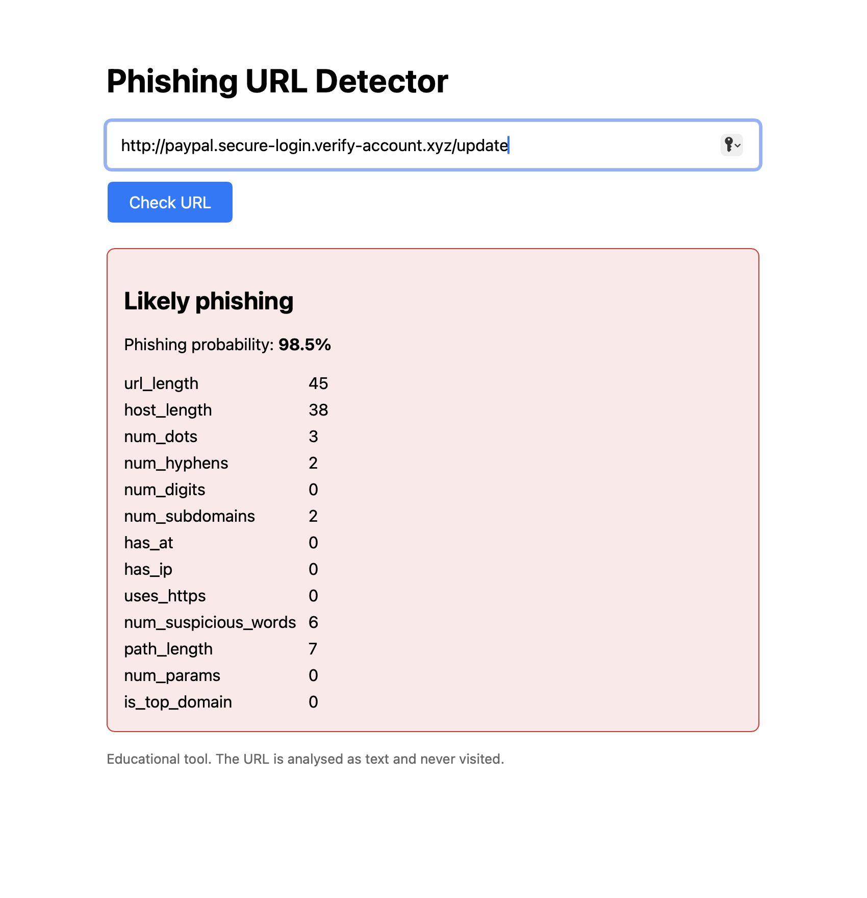

# Phishing URL Detector

A machine-learning tool that scores a URL as likely phishing or likely safe,
using only the text of the URL (the page is never visited).



## How it works
1. Normalise the URL and extract features (length, dots, digits, suspicious words, subdomains, top-domain rank, ...)
2. A random forest classifier predicts a phishing probability
3. A Flask web page shows the verdict and the features used

## Setup
```bash
git clone https://github.com/Matheos13/phishing-url-detector.git
cd phishing-url-detector
python3 -m venv venv && source venv/bin/activate
pip install -r requirements.txt
```
Download the datasets (not included because of size) into `data/`:
- Phishing URLs: Kaggle "Phishing Site URLs" -> `data/urls.csv`
- Top domains: tranco-list.eu -> `data/top-domains.csv`

```bash
python src/train.py   # trains and saves model.joblib
python app.py         # open http://127.0.0.1:5000
```

## Results
(table and report from above)

## What I learned / limitations
- The dataset had a formatting bias: nearly all "good" URLs ended with a slash,
  so the model treated a missing slash as a sign of phishing. Normalising URLs fixed it.
- URL text alone can't say a site is trustworthy, so I added a top-domain
  feature from the Tranco list, which stopped well-known sites being flagged.
- Phishing pages on legitimate hosts (e.g. shared platforms) can still slip through.
- Educational tool, not a replacement for real security software.
